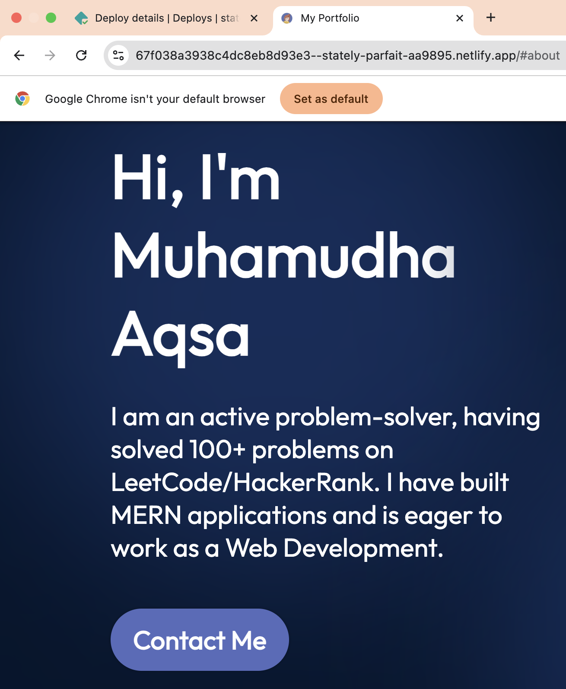
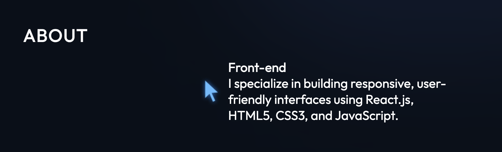
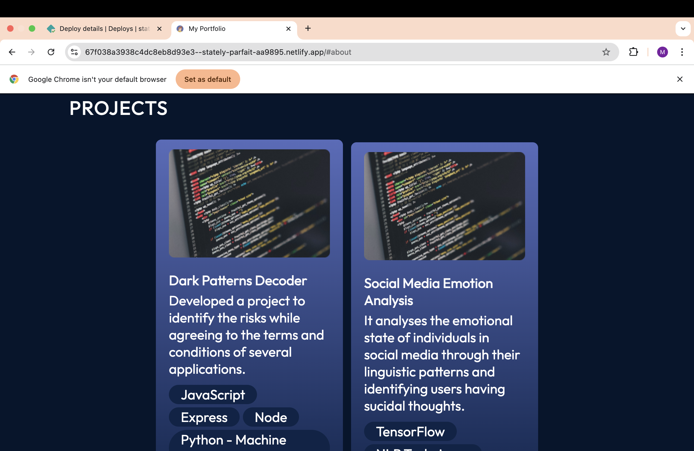

# PERSONAL PORTFOLIO WEBPAGE

COMPANY: CODTECH IT SOLUTIONS

NAME: MUHAMUDHA AQSA M A

INTERN ID: CT6WWRN

DOMAIN: FRONT END DEVELOPMENT

DURATION: 6 WEEKS

MENTOR: NEELA SANTOSH

 

A simple personal portfolio showcasing my skills, projects, and contact information.

Features
1. Clean and Modern User Interface (UI)

The platform is designed with a visually appealing and contemporary user interface, ensuring a polished first impression and a professional look.
The layout is intentionally minimalistic, reducing visual clutter while maintaining aesthetic consistency across all pages.
A focus on intuitive navigation ensures that users can easily locate features, access content, and move through the site without confusion.
Typography, color palette, and spacing are thoughtfully selected to promote clarity and readability, contributing to a smooth and comfortable browsing experience.
Icons, buttons, and visual elements are uniform and cohesive, aligning with modern design standards for a consistent feel.
The clean UI not only enhances usability but also reflects the creator's attention to detail and commitment to a high-quality digital presence.
2. Responsive Design (Mobile-Friendly)

The platform is developed with responsive web design principles, ensuring seamless accessibility across a variety of screen sizes and devices.
Whether accessed via desktop, laptop, tablet, or smartphone, the layout adapts fluidly to provide a user-friendly experience without the need for zooming or horizontal scrolling.
Interactive elements, such as menus, buttons, and links, are designed to be easily clickable and functional across touchscreens and traditional input methods.
The responsive design guarantees consistency in performance and appearance, regardless of the device used.
Media content, including images and embedded elements, is automatically rescaled and repositioned to fit the available screen space without compromising quality.
This mobile-friendly approach aligns with modern web standards and meets the expectations of today’s on-the-go users, providing accessibility and convenience from anywhere.
3. Feel Free to Explore and Connect with Me

Visitors are warmly encouraged to explore the platform at their own pace, engaging with available content and features in a way that suits their interests.
A welcoming tone throughout the site helps create a friendly and approachable digital environment, inviting users to interact without hesitation.
Clear calls to action are included to guide users toward further interaction, whether through contact forms, social links, or featured content.
Opportunities to connect — whether for collaboration, feedback, or conversation — are prominently available, promoting open communication.
The platform reflects a personal and professional identity, encouraging visitors to reach out and build meaningful connections.
This openness to connection demonstrates a commitment to community, responsiveness, and ongoing engagement with the audience.

## OUTPUT

### Home Page

### About Section

### Projects Section

